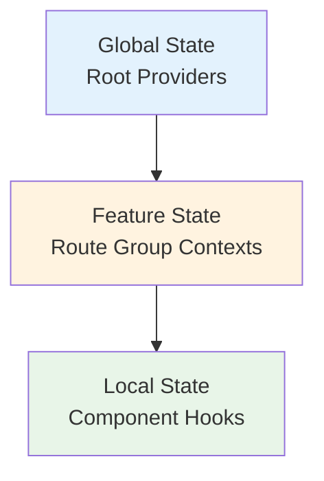

# 📁 SOS-Web `/app` 폴더 아키텍처 분석

## 🎯 개요

Next.js 13+ App Router를 활용한 **Route Groups 기반 모듈화 아키텍처**로, 개발부터 유지보수까지 전 생명주기를 고려한 구조입니다.

## 🏗️ 핵심 아키텍처 패턴

### **1. Route Groups를 통한 기능별 격리**

```
app/
├── (Auth)/          🔐 인증 영역
├── (Current)/       📊 메인 운영 영역
├── (Planning)/      📋 복잡한 기능 영역
├── (Common)/        🔄 공통 기능 영역
└── api/            🌐 API 라우트
```

**아키텍처 이점:**

-   ✅ **URL 구조 독립성**: Route Groups는 URL에 영향 없음
-   ✅ **기능별 완전 격리**: 각 영역의 독립적 개발/배포 가능
-   ✅ **팀 작업 효율성**: 기능별 담당자가 충돌 없이 작업 가능

### **2. 계층화된 복잡성 관리 (Planning 패턴)**

```typescript
(Planning)/
├── layout.tsx           // 🏗️ 기능별 레이아웃
├── error.tsx           // ❌ 에러 바운더리
├── hooks/              // 🎣 비즈니스 로직
├── contexts/           // 🌐 상태 관리
├── components/         // 🧩 UI 컴포넌트
├── actions/            // ⚡ 서버 액션
├── (Single)/           // 📄 하위 기능 1
├── (Multi)/            // 📊 하위 기능 2
└── (Setting)/          // ⚙️ 하위 기능 3
```

**설계 원칙:**

-   **Co-location**: 관련 리소스를 한 곳에 모음
-   **계층적 분리**: 복잡한 기능을 하위 Route Groups로 분할
-   **독립적 상태 관리**: 기능별 Context와 Hook 격리

### **3. API 버전 관리 전략**

```typescript
api/
├── v1/                 // ✨ 현재 API 버전
├── (v0)/              // 🏛️ 레거시 API (Route Group으로 숨김)
├── test/              // 🧪 테스트용 API
├── backend/           // 🔧 백엔드 로직
└── _common/           // 🔄 공통 API 유틸리티
```

**버전 관리 이점:**

-   ✅ **무중단 업그레이드**: v0 → v1 점진적 마이그레이션
-   ✅ **하위 호환성**: 레거시 API 유지
-   ✅ **테스트 격리**: 개발/테스트 환경 분리

## 🎯 개발 워크플로우 최적화

### **1. 팀 개발 효율성**

| 기능 영역  | 담당팀 | 독립성 | 충돌 위험    |
| ---------- | ------ | ------ | ------------ |
| (Auth)     | 보안팀 | ⭐⭐⭐ | ❌ 없음      |
| (Current)  | 운영팀 | ⭐⭐⭐ | ❌ 없음      |
| (Planning) | 기획팀 | ⭐⭐⭐ | ❌ 없음      |
| (Common)   | 공통팀 | ⭐⭐   | ⚠️ 주의 필요 |

### **2. 기능 확장성**

```typescript
// 새로운 기능 영역 추가 시
app/
├── (Analytics)/        // 🆕 새 기능 추가
│   ├── layout.tsx      // 독립적 레이아웃
│   ├── contexts/       // 전용 상태 관리
│   └── (Dashboard)/    // 하위 기능
└── ...existing
```

**확장 시나리오:**

-   ✅ **점진적 추가**: 기존 코드 영향 없이 새 기능 추가
-   ✅ **독립적 테스트**: 새 기능만 별도 테스트 가능
-   ✅ **롤백 용이성**: 문제 시 해당 Route Group만 제거

### **3. 상태 관리 계층화**



**계층별 책임:**

-   **Global**: 인증, 테마, 전역 설정
-   **Feature**: 기능별 복잡한 상태 (Planning Context)
-   **Local**: 컴포넌트별 단순 상태

## 🔧 유지보수성 분석

### **✅ 강점**

#### **1. 격리된 오류 범위**

```typescript
// Planning 영역에서 오류 발생 시
Planning / error.tsx; // 해당 영역만 에러 처리
// 다른 영역은 정상 동작 유지
```

#### **2. 독립적 배포**

-   **Code Splitting**: Route Groups별 자동 청크 분리
-   **Feature Flags**: 특정 기능만 배포/롤백 가능
-   **A/B Testing**: 기능별 실험 용이

#### **3. 명확한 책임 분리**

```typescript
// 각 영역의 명확한 역할
(Auth)/     → 인증/보안만 담당
(Current)/  → 실시간 운영만 담당
(Planning)/ → 계획/설정만 담당
```

### **⚠️ 주의점**

#### **1. 공통 영역 관리**

```typescript
(Common)/   // 여러 팀이 접근 → 충돌 위험
api/_common/ // 공통 API → 변경 시 영향도 큰
```

**완화 방안:**

-   공통 영역 변경 시 모든 팀 리뷰 필수
-   버전 관리를 통한 점진적 변경
-   충분한 테스트 커버리지

#### **2. 중복 코드 위험**

```typescript
// 각 Route Group에서 유사한 로직 중복 가능
Auth / hooks / useAuth.ts(Current) / hooks / useAuth.ts; // 중복 위험
```

**완화 방안:**

-   `/lib` 또는 `/utils` 폴더에 공통 로직 추출
-   TypeScript 모노레포 구조 검토
-   정기적 코드 리뷰로 중복 식별

## 📈 확장성 로드맵

### **Phase 1: 현재 구조 최적화**

-   [ ] 공통 컴포넌트 라이브러리 구축
-   [ ] API 스키마 표준화
-   [ ] 테스트 자동화 구축

### **Phase 2: 마이크로 프론트엔드 고려**

```typescript
// 향후 확장 시나리오
app/
├── (Auth)/          → 별도 서비스로 분리 가능
├── (Current)/       → 실시간 시스템으로 분리 가능
└── (Planning)/      → 기획 도구로 분리 가능
```

### **Phase 3: 엔터프라이즈 확장**

-   Module Federation 적용 검토
-   독립적 CI/CD 파이프라인
-   팀별 릴리즈 사이클 구축

## 🎯 권장사항

### **단기 개선**

1. **공통 라이브러리 구축**: `/lib` 폴더에 재사용 로직 중앙화
2. **타입 공유**: `/types` 폴더의 체계적 활용
3. **테스트 표준화**: 각 Route Group별 테스트 전략 수립

### **중장기 전략**

1. **모니터링 시스템**: 기능별 성능 지표 추적
2. **문서화 자동화**: 아키텍처 변경 시 자동 문서 업데이트
3. **개발자 경험**: 개발 도구 및 가이드라인 정비

---

**결론**: 현재 아키텍처는 **확장성**, **유지보수성**, **팀 협업** 관점에서 매우 우수한 구조입니다. Route Groups를 통한 기능별 격리와 계층화된 상태 관리는 대규모 프로젝트에 적합한 현대적 패턴입니다. 🚀
