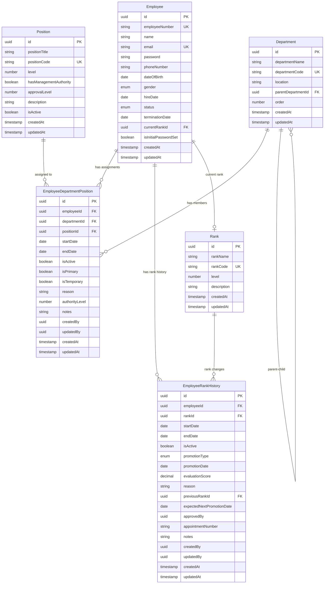

# HR 시스템 데이터베이스 설계 문서

## 📋 개요

본 문서는 LSSO(HR 시스템)의 데이터베이스 설계를 기술합니다. 조직변경이 잦은 환경에서 유연하고 확장 가능한 구조로 설계되었으며, 현재 상태 관리와 이력 추적을 동시에 지원합니다.

## 🎯 설계 철학

### 1. 관심사의 분리 (Separation of Concerns)

-   **Employee**: 직원 개인 정보만 관리
-   **Department**: 부서 정보 및 계층 구조
-   **Position**: 직책 정보 (부서장, 팀장, 직원 등)
-   **Rank**: 직급 정보 (사원, 대리, 과장 등)

### 2. 혼합 접근법 (Hybrid Approach)

-   **현재 상태**: 빠른 조회를 위한 직접 참조
-   **이력 관리**: 변경 과정의 완전한 추적
-   **중간테이블**: 복잡한 관계의 유연한 관리

### 3. 조직 변경 대응

-   부서/직책: 중간테이블로 다대다 관계 지원
-   직급: 현재 상태 + 이력 관리 혼합 방식
-   매니저 관계: 조직 구조에 통합

## 📊 엔티티 관계도 (ERD)



## 🗂️ 테이블 상세 설계

### 1. employees (직원)

**목적**: 직원 개인 정보 관리

| 컬럼명               | 타입      | 제약조건         | 설명                                 |
| -------------------- | --------- | ---------------- | ------------------------------------ |
| id                   | UUID      | PK               | 직원 고유 ID                         |
| employeeNumber       | VARCHAR   | UNIQUE, NOT NULL | 사번                                 |
| name                 | VARCHAR   | NOT NULL         | 이름                                 |
| email                | VARCHAR   | UNIQUE, NOT NULL | 이메일                               |
| password             | VARCHAR   | NULL             | 비밀번호                             |
| phoneNumber          | VARCHAR   | NULL             | 전화번호                             |
| dateOfBirth          | DATE      | NULL             | 생년월일                             |
| gender               | ENUM      | NULL             | 성별 (Male, Female, Other)           |
| hireDate             | DATE      | NOT NULL         | 입사일                               |
| status               | ENUM      | NOT NULL         | 재직상태 (Active, Leave, Terminated) |
| terminationDate      | DATE      | NULL             | 퇴사일                               |
| currentRankId        | UUID      | FK               | 현재 직급 ID                         |
| isInitialPasswordSet | BOOLEAN   | DEFAULT false    | 초기 비밀번호 설정 여부              |
| createdAt            | TIMESTAMP | NOT NULL         | 생성일                               |
| updatedAt            | TIMESTAMP | NOT NULL         | 수정일                               |

**인덱스**:

-   PK: id
-   UK: employeeNumber, email
-   FK: currentRankId → ranks(id)

### 2. departments (부서)

**목적**: 부서 정보 및 계층 구조 관리

| 컬럼명             | 타입      | 제약조건         | 설명         |
| ------------------ | --------- | ---------------- | ------------ |
| id                 | UUID      | PK               | 부서 고유 ID |
| departmentName     | VARCHAR   | NOT NULL         | 부서명       |
| departmentCode     | VARCHAR   | UNIQUE, NOT NULL | 부서 코드    |
| location           | VARCHAR   | NULL             | 위치         |
| parentDepartmentId | UUID      | FK               | 상위 부서 ID |
| order              | INTEGER   | DEFAULT 0        | 정렬 순서    |
| createdAt          | TIMESTAMP | NOT NULL         | 생성일       |
| updatedAt          | TIMESTAMP | NOT NULL         | 수정일       |

**인덱스**:

-   PK: id
-   UK: departmentCode
-   FK: parentDepartmentId → departments(id)

### 3. positions (직책)

**목적**: 직책 정보 및 권한 관리

| 컬럼명                 | 타입      | 제약조건         | 설명           |
| ---------------------- | --------- | ---------------- | -------------- |
| id                     | UUID      | PK               | 직책 고유 ID   |
| positionTitle          | VARCHAR   | NOT NULL         | 직책명         |
| positionCode           | VARCHAR   | UNIQUE, NOT NULL | 직책 코드      |
| level                  | INTEGER   | NOT NULL         | 직책 레벨      |
| hasManagementAuthority | BOOLEAN   | DEFAULT false    | 관리 권한 여부 |
| approvalLevel          | INTEGER   | DEFAULT 0        | 승인 권한 레벨 |
| description            | TEXT      | NULL             | 직책 설명      |
| isActive               | BOOLEAN   | DEFAULT true     | 활성 여부      |
| createdAt              | TIMESTAMP | NOT NULL         | 생성일         |
| updatedAt              | TIMESTAMP | NOT NULL         | 수정일         |

**인덱스**:

-   PK: id
-   UK: positionCode
-   IDX: level, hasManagementAuthority

### 4. ranks (직급)

**목적**: 직급 정보 관리

| 컬럼명      | 타입      | 제약조건         | 설명         |
| ----------- | --------- | ---------------- | ------------ |
| id          | UUID      | PK               | 직급 고유 ID |
| rankName    | VARCHAR   | NOT NULL         | 직급명       |
| rankCode    | VARCHAR   | UNIQUE, NOT NULL | 직급 코드    |
| level       | INTEGER   | NOT NULL         | 직급 레벨    |
| description | TEXT      | NULL             | 직급 설명    |
| createdAt   | TIMESTAMP | NOT NULL         | 생성일       |
| updatedAt   | TIMESTAMP | NOT NULL         | 수정일       |

**인덱스**:

-   PK: id
-   UK: rankCode
-   IDX: level

### 5. employee_department_positions (직원-부서-직책 관계)

**목적**: 직원의 부서 배정 및 직책 관리 (현재 상태)

| 컬럼명         | 타입      | 제약조건      | 설명           |
| -------------- | --------- | ------------- | -------------- |
| id             | UUID      | PK            | 배정 고유 ID   |
| employeeId     | UUID      | FK, NOT NULL  | 직원 ID        |
| departmentId   | UUID      | FK, NOT NULL  | 부서 ID        |
| positionId     | UUID      | FK, NOT NULL  | 직책 ID        |
| startDate      | DATE      | NOT NULL      | 시작일         |
| endDate        | DATE      | NULL          | 종료일         |
| isActive       | BOOLEAN   | DEFAULT true  | 활성 여부      |
| isPrimary      | BOOLEAN   | DEFAULT true  | 주 소속 여부   |
| isTemporary    | BOOLEAN   | DEFAULT false | 임시 발령 여부 |
| reason         | TEXT      | NULL          | 발령 이유      |
| authorityLevel | INTEGER   | NULL          | 권한 레벨      |
| notes          | TEXT      | NULL          | 비고           |
| createdBy      | UUID      | NULL          | 생성자 ID      |
| updatedBy      | UUID      | NULL          | 수정자 ID      |
| createdAt      | TIMESTAMP | NOT NULL      | 생성일         |
| updatedAt      | TIMESTAMP | NOT NULL      | 수정일         |

**인덱스**:

-   PK: id
-   UK: (employeeId, departmentId)
-   FK: employeeId → employees(id), departmentId → departments(id), positionId → positions(id)
-   IDX: (employeeId, isActive), (departmentId, isActive)

### 6. employee_rank_histories (직원 직급 이력)

**목적**: 직급 변경 이력 추적

| 컬럼명                    | 타입         | 제약조건     | 설명             |
| ------------------------- | ------------ | ------------ | ---------------- |
| id                        | UUID         | PK           | 이력 고유 ID     |
| employeeId                | UUID         | FK, NOT NULL | 직원 ID          |
| rankId                    | UUID         | FK, NOT NULL | 직급 ID          |
| startDate                 | DATE         | NOT NULL     | 시작일           |
| endDate                   | DATE         | NULL         | 종료일           |
| isActive                  | BOOLEAN      | DEFAULT true | 활성 여부        |
| promotionType             | ENUM         | NOT NULL     | 승진 유형        |
| promotionDate             | DATE         | NOT NULL     | 승진일           |
| evaluationScore           | DECIMAL(5,2) | NULL         | 평가 점수        |
| reason                    | TEXT         | NULL         | 승진 사유        |
| previousRankId            | UUID         | FK           | 이전 직급 ID     |
| expectedNextPromotionDate | DATE         | NULL         | 다음 예상 승진일 |
| approvedBy                | UUID         | NULL         | 승인자 ID        |
| appointmentNumber         | VARCHAR      | NULL         | 발령 번호        |
| notes                     | TEXT         | NULL         | 비고             |
| createdBy                 | UUID         | NULL         | 생성자 ID        |
| updatedBy                 | UUID         | NULL         | 수정자 ID        |
| createdAt                 | TIMESTAMP    | NOT NULL     | 생성일           |
| updatedAt                 | TIMESTAMP    | NOT NULL     | 수정일           |

**인덱스**:

-   PK: id
-   FK: employeeId → employees(id), rankId → ranks(id), previousRankId → ranks(id)
-   IDX: (employeeId, isActive), (employeeId, startDate), promotionDate

## 📚 Enum 정의

### Gender (성별)

```typescript
enum Gender {
    Male = 'MALE',
    Female = 'FEMALE',
    Other = 'OTHER',
}
```

### EmployeeStatus (재직상태)

```typescript
enum EmployeeStatus {
    Active = '재직중',
    Leave = '휴직',
    Terminated = '퇴사',
}
```

### PromotionType (승진유형)

```typescript
enum PromotionType {
    INITIAL = 'initial', // 최초 입사시 직급 부여
    PROMOTION = 'promotion', // 승진
    DEMOTION = 'demotion', // 강등
    ADJUSTMENT = 'adjustment', // 직급 조정
}
```

## 🔍 주요 비즈니스 로직

### 1. 직원 조직 배정

```sql
-- 직원의 현재 부서 및 직책 조회
SELECT e.name, d.departmentName, p.positionTitle
FROM employees e
JOIN employee_department_positions edp ON e.id = edp.employeeId
JOIN departments d ON edp.departmentId = d.id
JOIN positions p ON edp.positionId = p.id
WHERE edp.employeeId = ? AND edp.isActive = true;
```

### 2. 직급 승진 처리

```sql
-- 1. 기존 활성 이력 종료
UPDATE employee_rank_histories
SET endDate = ?, isActive = false
WHERE employeeId = ? AND isActive = true;

-- 2. 직원 현재 직급 업데이트
UPDATE employees
SET currentRankId = ?
WHERE id = ?;

-- 3. 새로운 승진 이력 생성
INSERT INTO employee_rank_histories (employeeId, rankId, startDate, promotionType, ...)
VALUES (?, ?, ?, 'PROMOTION', ...);
```

### 3. 부서 조직도 조회

```sql
-- 부서의 계층적 조직도
WITH RECURSIVE dept_hierarchy AS (
    SELECT id, departmentName, parentDepartmentId, 0 as level
    FROM departments
    WHERE id = ?

    UNION ALL

    SELECT d.id, d.departmentName, d.parentDepartmentId, dh.level + 1
    FROM departments d
    JOIN dept_hierarchy dh ON d.parentDepartmentId = dh.id
)
SELECT * FROM dept_hierarchy;
```

## 🚀 성능 최적화

### 1. 인덱스 전략

-   **자주 조회되는 컬럼**: employeeId, departmentId, isActive
-   **복합 인덱스**: (employeeId, isActive), (departmentId, isActive)
-   **고유 제약조건**: employeeNumber, email, departmentCode, positionCode

### 2. 쿼리 최적화

-   **Eager Loading**: 자주 함께 조회되는 관계는 eager loading 활용
-   **Lazy Loading**: 대용량 이력 데이터는 lazy loading으로 성능 확보
-   **인덱스 힌트**: 복잡한 쿼리에서 적절한 인덱스 활용

### 3. 데이터 아카이빙

-   **비활성 이력**: 일정 기간 후 별도 테이블로 이관
-   **퇴사자 데이터**: 법정 보관 기간 후 익명화 처리

## 📈 확장 계획

### 1. 추가 예정 테이블

-   **employee_department_histories**: 부서 변경 이력 (필요시)
-   **employee_position_histories**: 직책 변경 이력 (필요시)
-   **organization_changes**: 조직 개편 이력
-   **approval_workflows**: 승인 워크플로우

### 2. 성능 모니터링

-   **쿼리 성능**: 느린 쿼리 모니터링 및 최적화
-   **인덱스 효율성**: 사용되지 않는 인덱스 정리
-   **데이터 증가율**: 파티셔닝 전략 수립

## ✅ 설계 검증

### 1. ACID 특성 보장

-   **원자성**: 트랜잭션 단위 승진 처리
-   **일관성**: 외래키 제약조건으로 데이터 무결성 보장
-   **격리성**: 동시 승진 처리시 격리 레벨 설정
-   **지속성**: 변경 사항의 영구 저장

### 2. 정규화 수준

-   **3NF 준수**: 중복 데이터 최소화
-   **비정규화**: 성능을 위한 선택적 비정규화 (currentRankId)

### 3. 확장성

-   **수평 확장**: UUID 사용으로 분산 환경 대응
-   **수직 확장**: 인덱스 최적화로 대용량 데이터 처리

---

_본 설계 문서는 현재 구현된 엔티티를 기반으로 작성되었으며, 비즈니스 요구사항 변경에 따라 지속적으로 업데이트될 예정입니다._
