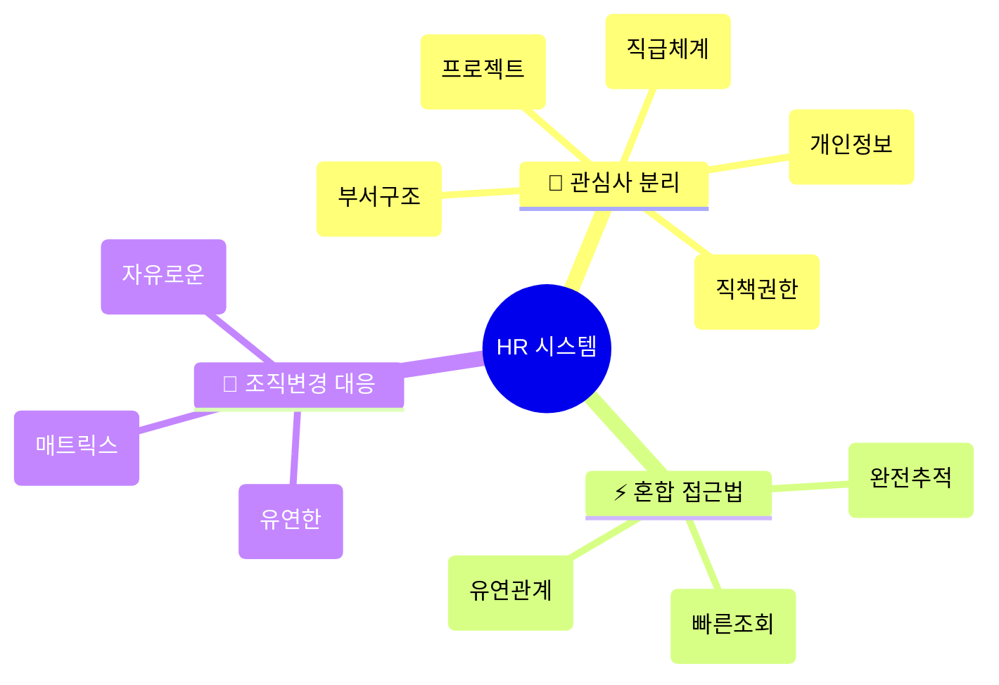
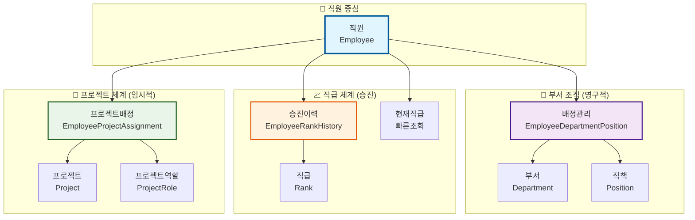
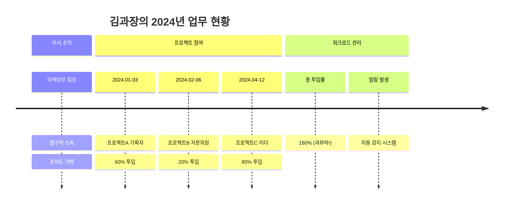
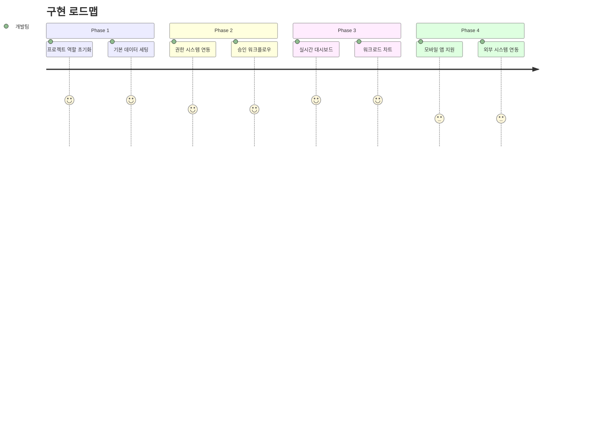

# 🏢 LSSO HR 시스템 - 전체 구조 한눈에 보기

## 🎯 핵심 설계 철학



## 📊 전체 시스템 아키텍처



## 🆚 부서 직책 vs 프로젝트 역할 비교

| 구분            | 🏢 부서 직책 (Position)  | 🚀 프로젝트 역할 (ProjectRole) |
| --------------- | ------------------------ | ------------------------------ |
| **🕐 지속성**   | `영구적` (승진까지)      | `임시적` (프로젝트 기간)       |
| **🌐 범위**     | `부서 내부` 한정         | `부서 횡단적` 협업             |
| **⚡ 변경빈도** | `낮음` (년 단위)         | `높음` (프로젝트별)            |
| **🔗 관계성**   | `1:1` (한 부서, 한 직책) | `N:M` (다중 프로젝트)          |
| **💡 예시**     | 부서장, 팀장, 직원       | PM, 개발자, 자문위원           |

## 📈 실제 사용 시나리오



## 🔧 핵심 기능들

### 📊 워크로드 관리

```sql
-- 🚨 과부하 직원 자동 감지
SELECT name, SUM(allocationPercentage) as 총투입률
FROM employee_project_assignments epa
JOIN employees e ON epa.employeeId = e.id
WHERE status = 'ACTIVE'
GROUP BY e.id
HAVING SUM(allocationPercentage) > 100;
```

### 🎯 스마트 배정 검증

```typescript
// ✅ 가용 용량 체크
const workload = await getEmployeeWorkload('employee-id');
if (workload.isOverloaded) {
    throw new Error(`현재 투입률 ${workload.totalAllocation}% - 추가 배정 불가`);
}
```

### 📈 실시간 대시보드

-   팀 구성 현황
-   리소스 투입 상태
-   프로젝트 진행률
-   과부하 알림

## 🗂️ 주요 엔티티 구조

### 🏢 부서 조직 (Department, Position)

-   **특징**: 영구적, 계층적
-   **관리**: 조직도, 승인권한
-   **변경**: 승진, 인사발령

### 🚀 프로젝트 (Project, ProjectRole)

-   **특징**: 임시적, 매트릭스
-   **관리**: 투입률, 워크로드
-   **변경**: 프로젝트별 유연

### 📈 직급 (Rank)

-   **특징**: 혼합방식 (현재상태 + 이력)
-   **관리**: 승진경로, 평가점수
-   **변경**: 체계적 승진절차

## ✅ 시스템 검증 완료

| 항목          | 상태      | 설명                 |
| ------------- | --------- | -------------------- |
| **🔧 빌드**   | ✅ 성공   | `npm run build` 통과 |
| **🔗 관계**   | ✅ 정상   | 모든 FK 제약조건     |
| **📊 인덱스** | ✅ 최적화 | 성능 튜닝 완료       |
| **🔄 로직**   | ✅ 검증   | 비즈니스 규칙 적용   |

## 🎖️ 핵심 장점

### ✅ **DO (권장사항)**


### ❌ **DON'T (비추천)**

-   Position 확장 (성격 혼재)
-   수동 관리 (오류 위험)
-   단일 테이블 (확장 제한)
-   이력 무시 (분석 불가)

## 🚀 다음 단계



---

## 🎯 **최종 결론**

**🏢 부서 조직**은 안정적인 계층 구조를, **🚀 프로젝트 체계**는 유연한 매트릭스 조직을 지원하여
**현대적인 HR 관리 시스템**이 완성되었습니다!

```
🎯 완벽한 분리 → 🔄 독립적 운영 → 📈 확장 가능성 → ✅ 미래 대응
```
