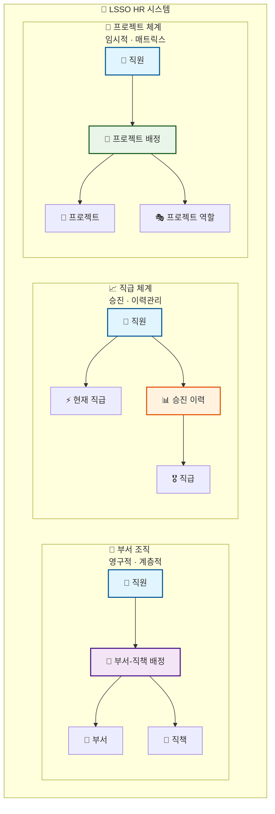
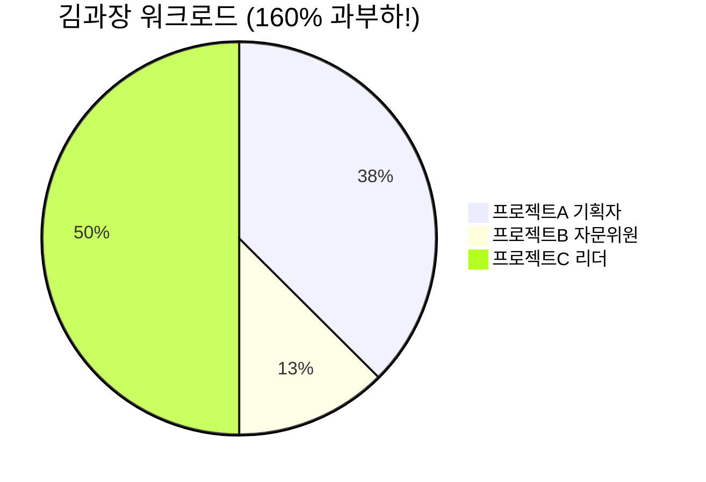

# 🏢 LSSO HR 시스템 - 한 장 요약

## 🎯 **3가지 핵심 체계**



---

## 🆚 **부서 직책 vs 프로젝트 역할**

<table>
<tr>
<th>🏢 부서 직책</th>
<th>🚀 프로젝트 역할</th>
</tr>
<tr>
<td>

**🕐 영구적** (승진까지)<br/>
**🏢 부서 내부** 한정<br/>
**📊 1:1** 관계<br/>
**💼 예시**: 부서장, 팀장

</td>
<td>

**⏱️ 임시적** (프로젝트 기간)<br/>
**🌐 부서 횡단적** 협업<br/>
**🔗 N:M** 관계<br/>
**🎯 예시**: PM, 개발자, 자문위원

</td>
</tr>
</table>

---

## 📊 **실제 사용 예시: 김과장의 업무 현황**



| 구분             | 내용                  | 투입률   |
| ---------------- | --------------------- | -------- |
| 🏢 **부서 소속** | 마케팅부 팀장         | `영구적` |
| 📊 **프로젝트A** | 기획자 (2024.01-03)   | `60%`    |
| 🔍 **프로젝트B** | 자문위원 (2024.02-06) | `20%`    |
| 🚀 **프로젝트C** | 리더 (2024.04-12)     | `80%`    |
| 🚨 **총 투입률** | **과부하 감지**       | `160%`   |

---

## 🔧 **핵심 기능**

### 📊 **워크로드 관리**

```sql
-- 과부하 직원 자동 감지
SELECT name, SUM(투입률) FROM 프로젝트배정
WHERE 상태 = '활성' GROUP BY 직원ID
HAVING SUM(투입률) > 100%;
```

### 🎯 **스마트 배정**

-   ✅ 가용 용량 자동 체크
-   🚨 과부하 알림 발생
-   📈 실시간 대시보드

### 📈 **완전한 이력 추적**

-   🏢 부서 이동 기록
-   📊 승진 과정 추적
-   🚀 프로젝트 참여 내역

---

## ✅ **시스템 현황**

| 항목          | 상태 | 비고                   |
| ------------- | ---- | ---------------------- |
| **🔧 빌드**   | ✅   | TypeScript 컴파일 성공 |
| **🗄️ 엔티티** | ✅   | 9개 테이블 설계 완료   |
| **🔗 관계**   | ✅   | 모든 FK 제약조건       |
| **📊 인덱스** | ✅   | 성능 최적화 완료       |

---

## 🎖️ **핵심 장점**


---

## 🚀 **완성된 HR 시스템**

> **🏢 안정적인 부서 조직** + **🚀 유연한 프로젝트 체계** = **💯 현대적 매트릭스 조직**

```
🎯 완벽한 분리 → 🔄 독립적 운영 → 📈 확장 가능 → ✅ 미래 대응
```

**✨ 조직변경이 잦은 환경에서도 안정적으로 운영되는 HR 시스템이 완성되었습니다!**
